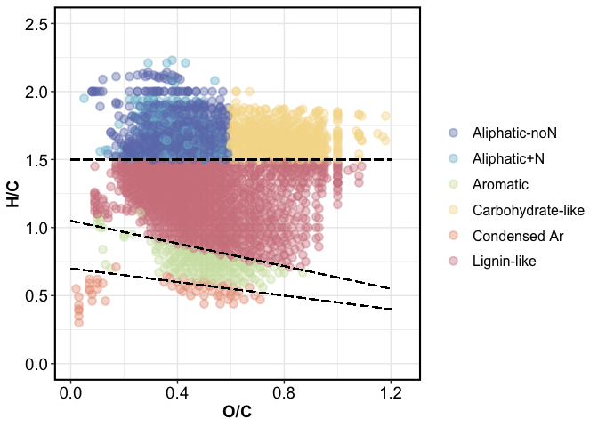
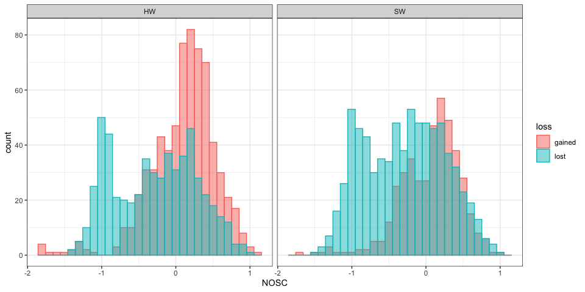

Markdown report
================

Figures and tables for the Fenton-adsorption analysis

-----

# DOC concentrations

    #> [1] "concentrations, mg/L"

| Forest |     Fenton | wsoc\_mg\_L |
| -----: | ---------: | ----------: |
|     HW | PostFenton |  458 ± 34.1 |
|     HW |  PreFenton |  497 ± 40.4 |
|     SW | PostFenton |     455 ± 7 |
|     SW |  PreFenton |   515 ± 6.3 |

    #> [1] "adsorbed C, mg/g goethite"

| Forest |     Fenton |   adsorbed |
| -----: | ---------: | ---------: |
|     HW | PostFenton | 10.6 ± 0.8 |
|     HW |  PreFenton | 10.5 ± 0.8 |
|     SW | PostFenton | 10.1 ± 0.2 |
|     SW |  PreFenton |   11 ± 0.1 |

-----

# FTICR-MS

## FTICR spectra

<!-- -->

## Summary tables

    #> [1] "average element occurrence"

| element | HW PreFenton | HW PostFenton | SW PreFenton | SW PostFenton |
| ------: | -----------: | ------------: | -----------: | ------------: |
|       C |           20 |            20 |           21 |            19 |
|       H |           26 |            27 |           27 |            27 |
|       N |            3 |             2 |            3 |             2 |
|       O |           10 |            12 |           10 |            12 |
|       P |            1 |             1 |            1 |             1 |
|       S |            1 |             1 |            1 |             1 |

    #> [1] "average relative abundance"

|             Class | HW PreFenton | HW PostFenton | SW PreFenton | SW PostFenton |
| ----------------: | -----------: | ------------: | -----------: | ------------: |
|      Condensed Ar |          2.5 |           0.3 |         1.87 |          0.29 |
|          Aromatic |        10.12 |          3.52 |         8.87 |          1.73 |
|       Lignin-like |         54.8 |         55.94 |        53.56 |         51.55 |
| Carbohydrate-like |          7.3 |            24 |         8.63 |         27.44 |
|     Aliphatic-noN |        14.85 |          9.73 |        18.26 |          14.3 |
|       Aliphatic+N |        10.44 |          6.51 |         8.81 |          4.69 |

    #> [1] "number of peaks"

|          Treatment |   HW |   SW |
| -----------------: | ---: | ---: |
|          PreFenton | 1562 | 1714 |
|         PostFenton | 1675 | 1385 |
|  PreFentonGoethite | 1993 | 1565 |
| PostFentonGoethite | 1629 | 1654 |

## Van Krevelen domains

1.  classes

<!-- -->

2.  DBE

<!-- -->

3.  NOSC

<!-- -->

## Effect of Fenton oxidation

### Pre- vs. post-Fenton Van Krevelen plots

<!-- -->

### Fenton loss/gain

1.  fenton loss-gain

<!-- -->

2.  fenton peaks lost – combined for HW and SW

|             Class | conserved | gained | lost |
| ----------------: | --------: | -----: | ---: |
|     Aliphatic-noN |       175 |     49 |  171 |
|       Aliphatic+N |        79 |     37 |  121 |
|          Aromatic |        57 |      4 |  148 |
| Carbohydrate-like |       141 |    347 |   21 |
|      Condensed Ar |         1 |      5 |   41 |
|       Lignin-like |       680 |    316 |  405 |

### NOSC

<!-- -->

all lost and gained – by forest

<!-- -->

## Goethite

<!-- -->

<!-- -->

contribution of groups

<!-- -->

adsorbed peaks common to pre and post-Fenton

<!-- -->

Fenton-gained peaks vs. adsorbed

<!-- -->

### NOSC

calculating NOSC of adsorbed molecules

<!-- --><!-- -->

-----

Session Info

Run: 2020-11-02

    #> R version 4.0.2 (2020-06-22)
    #> Platform: x86_64-apple-darwin17.0 (64-bit)
    #> Running under: macOS Catalina 10.15.7
    #> 
    #> Matrix products: default
    #> BLAS:   /Library/Frameworks/R.framework/Versions/4.0/Resources/lib/libRblas.dylib
    #> LAPACK: /Library/Frameworks/R.framework/Versions/4.0/Resources/lib/libRlapack.dylib
    #> 
    #> locale:
    #> [1] en_US.UTF-8/en_US.UTF-8/en_US.UTF-8/C/en_US.UTF-8/en_US.UTF-8
    #> 
    #> attached base packages:
    #> [1] stats     graphics  grDevices utils     datasets  methods   base     
    #> 
    #> other attached packages:
    #>  [1] patchwork_1.0.1    scales_1.1.1       forcats_0.5.0      stringr_1.4.0     
    #>  [5] purrr_0.3.4        readr_1.3.1        tidyr_1.1.1        tibble_3.0.3      
    #>  [9] tidyverse_1.3.0    soilpalettes_0.1.0 agricolae_1.3-3    car_3.0-9         
    #> [13] carData_3.0-4      nlme_3.1-148       stringi_1.4.6      ggExtra_0.9       
    #> [17] ggalt_0.4.0        ggplot2_3.3.2      reshape2_1.4.4     knitr_1.29        
    #> [21] qwraps2_0.4.2      cowplot_1.0.0      data.table_1.13.0  Rmisc_1.5         
    #> [25] plyr_1.8.6         lattice_0.20-41    luzlogr_0.2.0      dplyr_1.0.1       
    #> [29] readxl_1.3.1      
    #> 
    #> loaded via a namespace (and not attached):
    #>  [1] fs_1.5.0           lubridate_1.7.9    ash_1.0-15         RColorBrewer_1.1-2
    #>  [5] httr_1.4.2         tools_4.0.2        backports_1.1.8    R6_2.4.1          
    #>  [9] KernSmooth_2.23-17 AlgDesign_1.2.0    DBI_1.1.0          questionr_0.7.1   
    #> [13] colorspace_1.4-1   withr_2.2.0        tidyselect_1.1.0   klaR_0.6-15       
    #> [17] curl_4.3           compiler_4.0.2     extrafontdb_1.0    cli_2.0.2         
    #> [21] rvest_0.3.6        xml2_1.3.2         labeling_0.3       proj4_1.0-10      
    #> [25] digest_0.6.25      foreign_0.8-80     rmarkdown_2.3      rio_0.5.16        
    #> [29] pkgconfig_2.0.3    htmltools_0.5.0    extrafont_0.17     labelled_2.5.0    
    #> [33] dbplyr_1.4.4       fastmap_1.0.1      highr_0.8          maps_3.3.0        
    #> [37] rlang_0.4.7        rstudioapi_0.11    shiny_1.5.0        farver_2.0.3      
    #> [41] generics_0.0.2     jsonlite_1.7.0     combinat_0.0-8     zip_2.1.0         
    #> [45] magrittr_1.5       fansi_0.4.1        Rcpp_1.0.5         munsell_0.5.0     
    #> [49] abind_1.4-5        lifecycle_0.2.0    yaml_2.2.1         MASS_7.3-51.6     
    #> [53] grid_4.0.2         blob_1.2.1         promises_1.1.1     crayon_1.3.4      
    #> [57] miniUI_0.1.1.1     haven_2.3.1        hms_0.5.3          pillar_1.4.6      
    #> [61] PNWColors_0.1.0    reprex_0.3.0       glue_1.4.1         evaluate_0.14     
    #> [65] modelr_0.1.8       vctrs_0.3.2        httpuv_1.5.4       Rttf2pt1_1.3.8    
    #> [69] cellranger_1.1.0   gtable_0.3.0       assertthat_0.2.1   xfun_0.16         
    #> [73] openxlsx_4.1.5     mime_0.9           xtable_1.8-4       broom_0.7.0       
    #> [77] later_1.1.0.1      cluster_2.1.0      ellipsis_0.3.1

